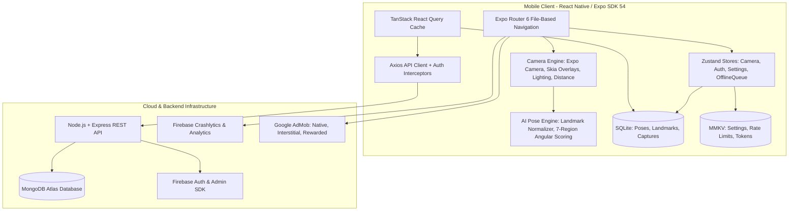

# 📸 Pose Hanum (POSEHANUM)

[](https://expo.dev)
[](https://reactnative.dev)
[](https://www.typescriptlang.org)
[](LICENSE)
[]()

> **Pose Hanum** is an offline-first, AI-assisted mobile photography guidance system built with **React Native (Expo SDK 54, React 19)**, powered by **MediaPipe 33-landmark real-time pose detection**, a **7-region angular scoring engine**, custom **Skia/Reanimated camera overlays**, and a **Node.js/Express & MongoDB Atlas backend**.

---

## 🌟 Key Features

- 🤖 **Real-Time AI Pose Guidance:** Real-time skeleton overlay with landmark normalization, scale/rotation invariance, and 7-region anatomical angular scoring.
- 📸 **Smart Auto-Capture & Voice Cues:** Automatic photo capture when pose matching exceeds score threshold (≥ 94%), accompanied by spoken voice cues and haptic feedback.
- 📴 **Offline-First Architecture:** Full functional parity offline powered by pre-populated **SQLite** (`pose-hanum.db`) and **MMKV** fast key-value storage.
- 🎨 **Camera Composition Overlays:** Dynamic camera guide overlays including Rule of Thirds, Golden Ratio grid, lighting estimator, distance detector, and adjustable pose opacity/transform controls.
- 📁 **Categorized Pose Library:** 26+ curated photography poses across 12 categories (Solo, Couples, Friends, Professional, Fashion, Travel, etc.) with downloadable pose packs.
- 🔐 **Multi-Provider Authentication:** Firebase Auth supporting Anonymous guest mode, Email/Password login, and Google OAuth with backend cloud sync.
- 💰 **Fair Monetization & AdMob:** Free daily capture limits with Rewarded Ads (+5 bonus captures), Interstitial ads with strict frequency capping, and App Open ads.
- 🌐 **Full-Stack Web Presence:** Next.js landing page & web app located in `/website`.

---

## 🏛 System Architecture



---

## 📐 7-Region Anatomical Pose Scoring Engine

Pose Hanum evaluates **33 anatomical landmarks** mapped to MediaPipe Pose topology. Scoring uses angular vector math across 7 distinct body regions with strict weight normalization:

$$\text{Total Score} = \sum_{r \in \text{Regions}} (\text{Weight}_r \times \text{Score}_r)$$

| Body Region | Weight | Key Joint Triples Evaluated |
| :--- | :--- | :--- |
| **Shoulders** | 15% | `[L_HIP, L_SHOULDER, R_SHOULDER]`, `[R_HIP, R_SHOULDER, L_SHOULDER]` |
| **Arms** | 20% | `[L_SHOULDER, L_ELBOW, L_WRIST]`, `[R_SHOULDER, R_ELBOW, R_WRIST]` |
| **Hands** | 10% | `[L_ELBOW, L_WRIST, L_INDEX]`, `[R_ELBOW, R_WRIST, R_INDEX]` |
| **Torso** | 20% | `[L_SHOULDER, L_HIP, R_HIP]`, `[R_SHOULDER, R_HIP, L_HIP]` |
| **Legs** | 20% | `[L_HIP, L_KNEE, L_ANKLE]`, `[R_HIP, R_KNEE, R_ANKLE]` |
| **Head** | 10% | `[L_SHOULDER, NOSE, R_SHOULDER]`, `[L_EAR, NOSE, R_EAR]` |
| **Feet** | 5% | `[L_KNEE, L_ANKLE, L_HEEL]`, `[R_KNEE, R_ANKLE, R_HEEL]` |

---

## 📁 Repository Directory Structure

```
posehanum/
├── app/                       # Expo Router route definitions
│   ├── (auth)/                # Authentication screens (Sign In, Sign Up, Onboarding)
│   ├── (tabs)/                # Main tab screens (Home, Poses, Camera, Favorites, Settings)
│   ├── pose/[id].tsx          # Pose detail view
│   ├── category/[slug].tsx    # Category listing view
│   └── gallery/               # Photo gallery and capture viewer
├── src/                       # Application source code
│   ├── components/            # Atomic Design system (atoms, molecules, organisms)
│   ├── constants/             # Design tokens, routes, and theme constants
│   ├── database/              # SQLite (`db.ts`) and MMKV (`mmkvClient.ts`) integrations
│   ├── features/              # Feature modules (AI engine, camera, poses, auth, ads)
│   ├── services/              # API client, Firebase analytics, Crashlytics, PostHog
│   └── stores/                # Zustand global state stores (auth, camera, settings)
├── backend/                   # Node.js + Express + TypeScript REST API
│   ├── src/
│   │   ├── controllers/       # Pose, User, and Favorite route controllers
│   │   ├── middleware/        # Auth, error handling, and rate-limiting middleware
│   │   ├── models/            # Mongoose schemas (Pose, User, Category)
│   │   └── index.ts           # Backend entry point
├── modules/                   # Native Expo modules
│   └── expo-pose-detector/    # Custom Android Kotlin MLKit/MediaPipe Pose Detector
├── scripts/                   # Utility & setup scripts
├── website/                   # Next.js promotional landing page
└── SECRETS.md                 # Security & environment credentials reference
```

---

## 🚀 Getting Started

### Prerequisites

- **Node.js**: `v18.x` or `v20.x`
- **Package Manager**: `pnpm` or `npm`
- **Android Development**: Android Studio, Android SDK (API 34+), NDK, and JDK 17
- **Expo Go / Development Build Tool**: `eas-cli` installed globally (`npm i -g eas-cli`)

### Setup Instructions

1. **Clone the repository:**
   ```bash
   git clone https://github.com/your-org/posehanum.git
   cd posehanum
   ```

2. **Install dependencies:**
   ```bash
   pnpm install
   # or
   npm install
   ```

3. **Configure Environment Variables:**
   Copy `.env.example` to `.env` and fill in your runtime values:
   ```bash
   cp .env.example .env
   ```
   *Required variables:*
   ```env
   EXPO_PUBLIC_MONGODB_API_URL=http://localhost:5000
   EXPO_PUBLIC_ADMOB_APP_ID=ca-app-pub-3940256099942544~3347511713
   ```

4. **Download MediaPipe Pose Detection Model Assets:**
   ```bash
   npm run download:model
   ```

5. **Start Development Server:**
   ```bash
   # Run Expo dev server offline
   npm run dev

   # Or run Android prebuild & native app
   npm run run:android
   ```

---

## ⚙️ Backend Setup

1. **Navigate to backend folder:**
   ```bash
   cd backend
   pnpm install
   ```

2. **Configure `.env` in `backend/`:**
   ```env
   PORT=5000
   MONGODB_URI=mongodb://localhost:27017/posehanum
   FIREBASE_PROJECT_ID=pose-hanum-c16f4
   ```

3. **Run Backend API:**
   ```bash
   npm run dev
   ```

---

## 🧪 Testing & Code Quality

Pose Hanum maintains an extensive test suite covering unit tests, property-based tests (fast-check), and UI component tests:

```bash
# Run unit & integration tests
npm test

# Run tests in watch mode
npm run test:watch

# Generate coverage report (Threshold: 85%)
npm run test:coverage

# Run TypeScript type check
npm run typecheck

# Run ESLint validation
npm run lint
```

---

## 🔐 Environment & Secrets Management

For production builds using Expo Application Services (EAS), credentials and API keys are injected at build time without committing sensitive files. Refer to [SECRETS.md](file:///f:/snappose/SECRETS.md) for full instructions on setting up:
- `MONGODB_API_URL`
- `ADMOB_APP_ID`, `ADMOB_NATIVE_ID`, `ADMOB_REWARDED_ID`, `ADMOB_INTERSTITIAL_ID`
- `GOOGLE_SERVICES_JSON` (Firebase configuration)

---

## 📄 License

Distributed under the MIT License. See `LICENSE` for more details.
