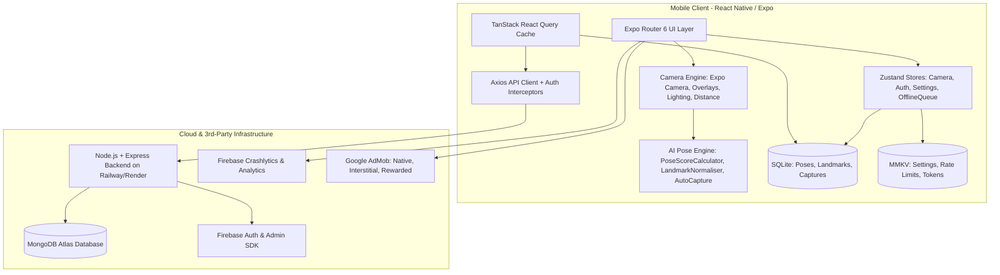

# 🏛️ Snap Pose — System Architecture Specification

## 1. High-Level Architecture Overview

Snap Pose is an offline-first, AI-assisted mobile photography guidance system built with **React Native (Expo SDK 54, React 19, New Architecture Ready)**, backed by a **Node.js/Express REST API** with **MongoDB Atlas** and **Firebase Services**.



---

## 2. Layered Architecture Design

### 2.1 Presentation & Routing Layer (`/app`, `/src/components`)
- **Expo Router v6**: File-based routing with deep-link support (`snappose://pose/[id]`, `snappose://category/[slug]`).
- **Atomic Design Component Hierarchy**:
  - `atoms/`: `SPButton`, `SPBadge`, `SPText`, `SPIcon`, `SPAvatar`, `SPDivider`, `SPProgressRing`.
  - `molecules/`: `SPPoseCard`, `SPCategoryCard`, `SPScoreBadge`, `SPSearchBar`, `SPToast`, `SPSkeletonCard`, `SPPermissionCard`.
  - `organisms/`: `SPBottomNav`, `SPDialog`, `SPBottomSheet`, `SPCategoryGrid`, `SPPoseGrid`.
  - `templates/`: `SPScreenTemplate`, `SPCameraTemplate`.
- **Styling & Theming**: Custom Design Tokens (`designTokens.ts`) supporting synchronous zero-flash light/dark/system themes persisted via MMKV with Reanimated cross-fade animations.

### 2.2 Domain & Core Logic Layer (`/src/features`)
Organized by feature domains according to Clean Architecture:
- **`features/ai`**: MediaPipe 33-landmark parser, scale/translation/rotational normalizer, regional angular weighted scoring engine (7 anatomical regions), automatic capture triggers, and real-time voice coaching cues.
- **`features/camera`**: Dynamic pose overlay transforms (pan/pinch/rotate/opacity), rule-of-thirds & golden ratio composition overlays, face analysis, lighting quality calculation, distance estimator, and capture rate limiter.
- **`features/poses`**: Static curated dataset (26 photography poses across 12 categories) with offline fallback, SQLite repository, and MongoDB synchronization.
- **`features/favorites`**: Local-first favorite management with reactive UI updates and backend cloud sync.
- **`features/downloads`**: Offline pose pack downloader with checksum verification, file system caching, and storage tracking.
- **`features/ads`**: AdMob adapter with frequency capping (3 captures per interstitial, 45s cooldown) and rewarded ad unlocks (+5 bonus captures).
- **`features/auth`**: Firebase Authentication supporting Anonymous guest mode, Google OAuth, and Email/Password sessions.

### 2.3 State Management Layer (`/src/stores`)
- **`authStore.ts`**: Zustand store managing current session, anonymous sign-in, user identity, and token dispatch.
- **`cameraStore.ts`**: High-performance in-memory Zustand store for real-time camera state (live pose match score, distance state, lighting rating, active countdown, overlay matrix transforms).
- **`settingsStore.ts`**: Synchronously hydrated MMKV-backed store managing camera preferences (flash, grid, overlay opacity, auto-capture thresholds, voice coaching, smile detection gate, theme, language).
- **`offlineQueueStore.ts`**: FIFO offline mutation queue with auto-retry on reconnect.

### 2.4 Persistence & Local Storage Architecture
Dual-tier storage architecture:
1. **MMKV (`react-native-mmkv`)**:
   - Ultra-low latency synchronous key-value storage for settings, auth tokens, rate-limit counters, and active session properties.
2. **SQLite (`expo-sqlite` with WAL mode)**:
   - Structured relational database (`snap-pose.db`) with Foreign Keys and WAL (Write-Ahead Logging) enabled.
   - Houses offline poses, pre-computed reference landmark coordinates, download registry, recent search keywords, photo capture metadata, and gallery favorites.

---

## 3. AI Computer Vision & Pose Scoring Engine

### 3.1 Landmark Topology & MediaPipe Integration
The pose engine evaluates 33 full-body anatomical landmarks mapped to standard MediaPipe Pose indices (Nose, Eyes, Shoulders, Elbows, Wrists, Hips, Knees, Ankles, Feet, Hands).

### 3.2 7-Region Angular Scoring Engine
Instead of naïve point distance matching, Snap Pose computes angular differences across 7 distinct anatomical regions with strict weight normalization:
$$\text{Total Score} = \sum_{r \in \text{Regions}} (\text{Weight}_r \times \text{Score}_r)$$

| Body Region | Weight | Evaluated Joint Triples |
| :--- | :--- | :--- |
| **Shoulders** | 15% | [L_HIP, L_SHOULDER, R_SHOULDER], [R_HIP, R_SHOULDER, L_SHOULDER], [L_SHOULDER, R_SHOULDER, R_HIP] |
| **Arms** | 20% | [L_SHOULDER, L_ELBOW, L_WRIST], [R_SHOULDER, R_ELBOW, R_WRIST], [L_HIP, L_SHOULDER, L_ELBOW], [R_HIP, R_SHOULDER, R_ELBOW] |
| **Hands** | 10% | [L_ELBOW, L_WRIST, L_INDEX], [R_ELBOW, R_WRIST, R_INDEX], [L_ELBOW, L_WRIST, L_THUMB], [R_ELBOW, R_WRIST, R_THUMB] |
| **Torso** | 20% | [L_SHOULDER, L_HIP, R_HIP], [R_SHOULDER, R_HIP, L_HIP], [L_SHOULDER, R_SHOULDER, R_HIP], [L_HIP, R_HIP, R_SHOULDER] |
| **Legs** | 20% | [L_HIP, L_KNEE, L_ANKLE], [R_HIP, R_KNEE, R_ANKLE], [L_SHOULDER, L_HIP, L_KNEE], [R_SHOULDER, R_HIP, R_KNEE] |
| **Head** | 10% | [L_SHOULDER, NOSE, R_SHOULDER], [L_EAR, NOSE, R_EAR], [L_SHOULDER, L_EAR, NOSE], [R_SHOULDER, R_EAR, NOSE] |
| **Feet** | 5% | [L_KNEE, L_ANKLE, L_HEEL], [R_KNEE, R_ANKLE, R_HEEL], [L_ANKLE, L_HEEL, L_FOOT_INDEX], [R_ANKLE, R_HEEL, R_FOOT_INDEX] |
| **Total** | **100%** | **Rigidly validated at load time** |

- Low-confidence landmarks (visibility $< 0.60$) are gracefully skipped.
- Total score is constrained within $[15, 98]$ (pure Kotlin `coerceIn` parity).
- Scores $\ge 94\%$ trigger auto-capture readiness.

---

## 4. Backend System Architecture (`/backend`)

- **Runtime**: Node.js $\ge 18$ with TypeScript and Express 4.19.
- **Database**: MongoDB Atlas via Mongoose 8.4 with connection pooling and schema indices.
- **Security**: Helmet HTTP headers, CORS whitelisting, Gzip compression, Express Rate Limiter, and Firebase Admin ID Token verification.
- **Envelope Response Format**:
```json
{
  "success": true,
  "data": { ... },
  "timestamp": "2026-08-16T14:30:00.000Z"
}
```

---

## 5. Monetization & Free Tier Architecture
- **Free Tier Policy**: 10 photo captures per 6-hour rolling window.
- **Ad Incentive**: Watching a rewarded video ad grants $+5$ bonus captures.
- **AdMob Units Supported**: App Open, Banner/Native In-Feed, Interstitial (rate-limited), Rewarded Video.
