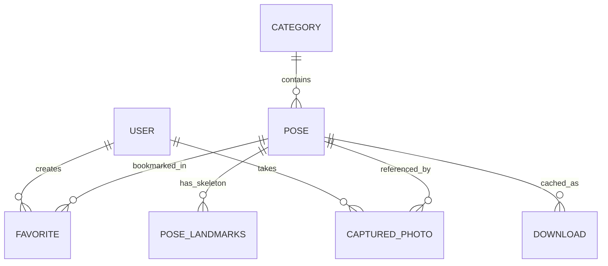

# 🗄️ Snap Pose — Database Intelligence & Data Model Map

## 1. Storage Architecture Overview

Snap Pose employs a tri-layer data storage strategy:
1. **Cloud Database**: MongoDB Atlas via Mongoose ODM for poses, categories, user profiles, cloud favorites, and remote configuration.
2. **Local Relational Database**: SQLite (`expo-sqlite` with WAL mode) for full offline capabilities (cached poses, precomputed landmarks, downloads, local photo metadata, search history).
3. **High-Speed Synchronous Key-Value Store**: MMKV (`react-native-mmkv`) for ultra-low latency reads/writes of user preferences, UI theme, camera settings, auth tokens, and local rolling capture rate limiters.



---

## 2. Cloud Database (MongoDB Atlas)

### 2.1 `poses` Collection (`backend/src/models/Pose.ts`)
Stores master pose definitions and photography guidelines.

| Field Name | BSON Type | Constraints / Indexes | Default | Description |
| :--- | :--- | :--- | :--- | :--- |
| `_id` | ObjectId | Primary Key | auto | Internal MongoDB identifier |
| `id` | String | Unique, Indexed | Required | Unique alphanumeric slug (e.g. `'pose-1'`) |
| `categoryId` | String | Indexed | Required | Foreign key to Category collection |
| `title` | String | None | Required | Display title of the pose |
| `description` | String | None | `""` | Detailed pose instructions |
| `imageUrl` | String | None | Required | High-res reference photograph URL |
| `overlayImage` | String | None | Required | Transparent silhouette overlay PNG URL |
| `thumbnailUrl` | String | None | Required | Compressed thumbnail URL for feeds |
| `difficulty` | String | Enum: `'easy'`, `'medium'`, `'hard'` | `'easy'` | Execution difficulty |
| `indoor` | Boolean | None | `true` | True if indoor pose, false if outdoor |
| `tags` | Array\<String\>| Indexed | `[]` | Search tags (e.g. `['solo', 'street', 'candid']`) |
| `views` | Number | None | `0` | Cumulative view counter |
| `downloads` | Number | None | `0` | Cumulative offline pack downloads |
| `favorites` | Number | None | `0` | Cumulative favorite saves |
| `estimatedDistance`| Number | None | `2.0` | Recommended camera-to-subject distance (meters) |
| `cameraAngle` | String | None | `'Eye Level'` | Suggested camera angle (e.g. `'Low Angle'`) |
| `lighting` | String | None | `'Natural Soft Light'` | Suggested lighting conditions |
| `orientation` | String | Enum: `'portrait'`, `'landscape'` | `'portrait'` | Intended camera framing |
| `createdAt` | Date | Timestamp | auto | Creation timestamp |
| `updatedAt` | Date | Timestamp | auto | Last update timestamp |

---

### 2.2 `categories` Collection (`backend/src/models/Category.ts`)
Categorical groupings of poses.

| Field Name | BSON Type | Constraints / Indexes | Default | Description |
| :--- | :--- | :--- | :--- | :--- |
| `_id` | ObjectId | Primary Key | auto | Internal MongoDB identifier |
| `id` | String | Unique, Indexed | Required | Category identifier (e.g. `'street'`) |
| `name` | String | None | Required | Category display title (e.g. `'Street'`) |
| `slug` | String | Unique | Required | URL-safe slug |
| `image` | String | None | Required | Cover image URL |
| `icon` | String | None | `'camera'` | Icon identifier or emoji |
| `color` | String | None | `'#65744A'` | Category theme accent color |
| `totalPoses` | Number | None | `0` | Total poses count in category |
| `sortOrder` | Number | None | `0` | Sorting display sequence |

---

### 2.3 `users` Collection (`backend/src/models/User.ts`)
User account profiles and rate-limiting state.

| Field Name | BSON Type | Constraints / Indexes | Default | Description |
| :--- | :--- | :--- | :--- | :--- |
| `_id` | ObjectId | Primary Key | auto | Internal identifier |
| `uid` | String | Unique, Indexed | Required | Firebase Auth User ID |
| `email` | String | Optional | None | User email address |
| `displayName` | String | Optional | None | Display name |
| `isAnonymous` | Boolean | None | `true` | True for guest users |
| `captureStats.totalCaptures` | Number | None | `0` | Lifetime photos taken |
| `captureStats.windowStartTime` | Number | None | `Date.now` | Epoch ms timestamp of current 6h window |
| `captureStats.windowCaptureCount`| Number | None | `0` | Photos taken in current 6h window |
| `captureStats.bonusCaptures` | Number | None | `0` | Extra captures granted via rewarded ads |

---

### 2.4 `favorites` Collection (`backend/src/models/Favorite.ts`)
User saved pose bookmarks.

| Field Name | BSON Type | Constraints / Indexes | Description |
| :--- | :--- | :--- | :--- |
| `userId` | String | Compound Unique Index with `poseId` | Firebase UID |
| `poseId` | String | Compound Unique Index with `userId` | Pose ID |
| `createdAt` | Date | Timestamp | Bookmark timestamp |

---

### 2.5 `feedback` Collection (`backend/src/models/Feedback.ts`)
User issue reports, feature requests, and inquiries.

| Field Name | BSON Type | Description |
| :--- | :--- | :--- |
| `userId` | String | Submitting user UID or `'anonymous'` |
| `type` | String | `'bug'`, `'suggestion'`, or `'feedback'` |
| `message` | String | Text content |
| `createdAt` | Date | Submission timestamp |

---

### 2.6 `appconfigs` Collection (`backend/src/models/AppConfig.ts`)
Remote feature flags and runtime thresholds.

| Field Name | BSON Type | Default | Description |
| :--- | :--- | :--- | :--- |
| `key` | String (Unique) | `'global'` | Configuration partition key |
| `maintenanceMode` | Boolean | `false` | Global maintenance toggle |
| `minimumVersion` | String | `'1.0.0'` | Minimum supported client version |
| `latestVersion` | String | `'1.0.0'` | Latest published version |
| `adsEnabled` | Boolean | `true` | Master ad monetization switch |
| `autoCaptureThreshold` | Number | `94` | Required AI pose score % for auto-shutter |
| `voiceGuidanceEnabled` | Boolean | `true` | Default state of voice coaching |

---

## 3. Local Relational Database (SQLite: `snap-pose.db`)

### 3.1 SQLite Tables & Schema DDL (`src/database/sqlite/db.ts`)

#### 1. `poses`
Offline-cached pose repository.
```sql
CREATE TABLE IF NOT EXISTS poses (
  id         TEXT PRIMARY KEY NOT NULL,
  title      TEXT NOT NULL,
  category   TEXT NOT NULL,
  image      TEXT,
  overlay    TEXT,
  difficulty TEXT NOT NULL DEFAULT 'easy',
  indoor     INTEGER NOT NULL DEFAULT 1,
  tags       TEXT NOT NULL DEFAULT '[]',
  views      INTEGER NOT NULL DEFAULT 0,
  downloads  INTEGER NOT NULL DEFAULT 0,
  favorites  INTEGER NOT NULL DEFAULT 0,
  updatedAt  TEXT NOT NULL
);
CREATE INDEX IF NOT EXISTS idx_poses_category ON poses(category);
```

#### 2. `pose_landmarks`
Precomputed 33-point MediaPipe reference landmark coordinates.
```sql
CREATE TABLE IF NOT EXISTS pose_landmarks (
  poseId     TEXT PRIMARY KEY NOT NULL,
  landmarks  TEXT NOT NULL -- JSON serialized array of Landmark objects
);
```

#### 3. `favorites`
Local bookmarks.
```sql
CREATE TABLE IF NOT EXISTS favorites (
  id         TEXT PRIMARY KEY NOT NULL,
  poseId     TEXT NOT NULL,
  createdAt  TEXT NOT NULL,
  UNIQUE(poseId)
);
CREATE INDEX IF NOT EXISTS idx_favorites_poseId ON favorites(poseId);
```

#### 4. `downloads`
Downloaded offline pose packs registry.
```sql
CREATE TABLE IF NOT EXISTS downloads (
  id           TEXT PRIMARY KEY NOT NULL,
  poseId       TEXT NOT NULL UNIQUE,
  version      INTEGER NOT NULL DEFAULT 1,
  downloadedAt TEXT NOT NULL,
  filePath     TEXT NOT NULL,
  sha256       TEXT NOT NULL DEFAULT '',
  sizeBytes    INTEGER NOT NULL DEFAULT 0
);
CREATE INDEX IF NOT EXISTS idx_downloads_poseId ON downloads(poseId);
```

#### 5. `recent_searches`
Search history keyword cache.
```sql
CREATE TABLE IF NOT EXISTS recent_searches (
  id        TEXT PRIMARY KEY NOT NULL,
  keyword   TEXT NOT NULL UNIQUE,
  createdAt TEXT NOT NULL
);
```

#### 6. `recent_views`
Pose viewing history.
```sql
CREATE TABLE IF NOT EXISTS recent_views (
  id       TEXT PRIMARY KEY NOT NULL,
  poseId   TEXT NOT NULL UNIQUE,
  viewedAt TEXT NOT NULL
);
CREATE INDEX IF NOT EXISTS idx_recent_views_viewedAt ON recent_views(viewedAt);
```

#### 7. `captured_photos`
Local metadata for photos taken within Snap Pose.
```sql
CREATE TABLE IF NOT EXISTS captured_photos (
  id         TEXT PRIMARY KEY NOT NULL,
  poseId     TEXT NOT NULL DEFAULT '',
  localPath  TEXT NOT NULL,
  thumbnail  TEXT NOT NULL DEFAULT '',
  width      INTEGER NOT NULL DEFAULT 0,
  height     INTEGER NOT NULL DEFAULT 0,
  aiScore    INTEGER NOT NULL DEFAULT 0,
  capturedAt TEXT NOT NULL,
  favorite   INTEGER NOT NULL DEFAULT 0
);
CREATE INDEX IF NOT EXISTS idx_captured_photos_capturedAt ON captured_photos(capturedAt);
```

---

## 4. Key-Value Registry (MMKV)

File location: Native encrypted sandbox partition (`src/database/mmkv/keys.ts`).

| MMKV Key | Type | Description |
| :--- | :--- | :--- |
| `theme` | string (`'light'` \| `'dark'` \| `'system'`) | Active visual theme mode |
| `language` | string (e.g. `'en'`) | App localization language |
| `firstLaunch` | boolean | Tracks first-time app launch for onboarding routing |
| `cameraSettings` | JSON string (`CameraSettings`) | Persisted camera configs: `flashMode`, `gridType`, `overlayOpacity`, `autoCaptureThreshold`, `voiceGuidanceEnabled`, `smileRequired` |
| `captureCount` | number | Photos captured in the current 6-hour rolling window |
| `windowStartTime` | number (epoch ms) | Timestamp when current 6-hour rate-limit window opened |
| `bonusCaptures` | number | Extra photo captures granted via rewarded video ads |
| `gallery_favorites`| JSON string (`string[]`) | Set of favorite media library asset IDs |
| `hapticsEnabled` | boolean | Haptic vibration trigger preference |
| `autoSavePhotos` | boolean | Automatic gallery save preference |
| `recentSearches` | JSON string (`string[]`) | In-memory cached recent query terms |
