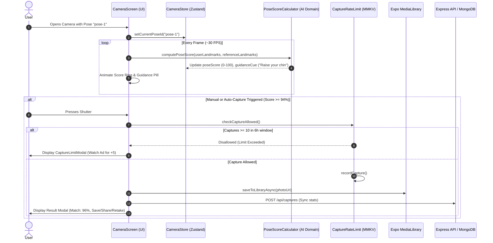

# 🧠 Snap Pose — Permanent Codebase Intelligence & Memory (memory.md)

> **Document Classification**: Permanent Repository Memory & System Intelligence  
> **Version**: 1.0.0  
> **Framework**: React Native (Expo SDK 54, React 19) + Node.js/Express Backend + MongoDB Atlas  
> **Primary Author / Staff Architect**: AI Codebase Intelligence Agent  

---

## 1. Project Overview & Business Purpose

### 1.1 What the Project Does
**Snap Pose** is an AI-powered mobile photography assistant designed to eliminate awkward posing and failed photo attempts. Unlike passive inspiration galleries (such as Pinterest or Instagram), Snap Pose actively guides users **before, during, and after taking photos** by overlaying translucent reference silhouettes on a live camera viewfinder, computing real-time angular body similarity scores using MediaPipe computer vision topology, providing voice & visual positioning coaching, and automatically capturing high-scoring poses.

### 1.2 Tagline & Brand Identity
- **Tagline**: *"POSE IT. SNAP IT. SHARE IT."*
- **Visual Aesthetic**: Rich forest green (`#28351D`), deep olive (`#65744A`), warm cream canvas (`#F6F1E7`), and sleek charcoal dark mode (`#181818`), paired with modern typography, glassmorphic navigation bars, and spring micro-interactions.

### 1.3 Target Users & Core Personas
1. **Solo Travelers**: Capturing high-quality travel photographs without needing a third-party photographer via AI auto-shutter and distance estimation.
2. **Content Creators & Influencers**: Recreating curated aesthetic poses across street, cafe, studio, and fashion settings.
3. **Couples & Groups**: Coordinating multi-person framing and romantic poses effortlessly.
4. **Casual Smartphone Photographers**: Gaining posing confidence with real-time feedback and pro lighting advice.

---

## 2. Tech Stack Matrix

| Layer | Technologies / Libraries |
| :--- | :--- |
| **Mobile Core** | React Native 0.81.5, React 19.1.0, Expo SDK 54 (`expo`, `expo-router` v6) |
| **Language** | TypeScript 5.3+ (Strict typing enabled, typed routes active) |
| **Styling & Design** | NativeWind v4, Vanilla CSS Design Tokens (`designTokens.ts`), custom `ThemeProvider` |
| **Animation & Gestures**| React Native Reanimated v4, React Native Gesture Handler v2, React Native Worklets |
| **Graphics & Lists** | Shopify React Native Skia v2, Shopify FlashList v2 |
| **Camera & Media** | Expo Camera (`CameraView`), Expo Media Library, Expo Haptics, Expo Speech |
| **State Management** | Zustand v4 (Camera, Auth, Settings, Offline Queue) |
| **Network & Cache** | TanStack React Query v5, Axios v1.7 |
| **Local Persistence** | `react-native-mmkv` (Synchronous C++ KV), `expo-sqlite` (WAL Mode Relational DB) |
| **Backend API** | Node.js (v18+), Express v4.19, TypeScript, Mongoose v8.4, Helmet, Compression, Cors |
| **Cloud Database** | MongoDB Atlas (Mongoose ODM) |
| **Auth & Telemetry** | Firebase Authentication, Firebase Crashlytics, Firebase Analytics |
| **Monetization** | Google Mobile Ads SDK (`react-native-google-mobile-ads` / AdMob) |
| **Testing** | Jest 29, Jest Expo, `@testing-library/react-native`, Fast-Check (Property-Based Testing) |

---

## 3. Complete Repository Structure

```
snappose/
├── .env.example                     # Client environment variables template
├── app.config.ts                    # Expo configuration with native permissions & EAS
├── babel.config.js                  # Babel compiler config
├── eas-update.config.js             # EAS OTA update configuration
├── metro.config.js                  # Metro bundler with NativeWind & SVG transformers
├── package.json                     # Frontend dependencies & Jest configuration
├── tsconfig.json                    # Root TypeScript configuration
│
├── app/                             # Expo Router v6 App Directory
│   ├── _layout.tsx                  # Global Root Layout (QueryClient, Theme, Gestures, Stack)
│   ├── +not-found.tsx               # 404 Fallback Screen
│   ├── (auth)/                      # Authentication / Onboarding Route Group
│   │   ├── _layout.tsx              # Auth Stack Layout (no bottom nav)
│   │   ├── splash.tsx               # Startup Splash & First Launch Hydration
│   │   └── onboarding.tsx           # Multi-slide Onboarding Walkthrough
│   ├── (tabs)/                      # Main Tab Navigation Group
│   │   ├── _layout.tsx              # Custom Glassmorphism Tab Bar with Center Camera FAB
│   │   ├── index.tsx                # Discovery Home (Categories, Hero, Trending, Editor's Picks)
│   │   ├── search.tsx               # Real-time Pose Search with MMKV History & Filters
│   │   ├── camera.tsx               # Viewfinder with AI Assist Mode, Overlays, Capture
│   │   ├── favorites.tsx            # Saved Poses Collection with Multi-sorting
│   │   └── settings.tsx             # Preferences, Themes, Flash, Legal, About Modals
│   ├── pose/[id].tsx                # Detailed Pose Inspector with Step-by-Step Instructions
│   ├── category/[slug].tsx          # Full Category Gallery View
│   ├── gallery/index.tsx            # 3-Column Recycled Media Gallery with Multi-Select Delete
│   ├── downloads/index.tsx          # Offline Pose Pack Manager & Storage Analyzer
│   └── capture-limit/index.tsx      # Daily/Rolling 6h Capture Limit & Rewarded Ad Unlock Modal
│
├── src/                             # Core Application Source
│   ├── __pbt__/                     # Fast-check Property-Based Test Suites
│   ├── components/                  # Atomic Design UI Components
│   │   ├── atoms/                   # SPButton, SPBadge, SPText, SPIcon, SPAvatar, SPDivider
│   │   ├── molecules/               # SPPoseCard, SPCategoryCard, SPScoreBadge, SPSearchBar, SPToast
│   │   ├── organisms/               # SPBottomNav, SPDialog, SPBottomSheet, SPCategoryGrid
│   │   └── templates/               # SPScreenTemplate, SPCameraTemplate
│   ├── constants/                   # Design Tokens, Theme Context, Remote Config Keys, Routes
│   ├── database/
│   │   ├── mmkv/                    # Synchronous MMKV Client & Typed Key Definitions
│   │   └── sqlite/                  # SQLite Initialization, Migrations, Pose & Capture DAOs
│   ├── features/                    # Feature Domain Modules (Clean Architecture)
│   │   ├── ads/                     # AdMob Adapter, Frequency Controller, Rewarded Ad Service
│   │   ├── ai/                      # PoseScoreCalculator, LandmarkNormaliser, AutoCaptureEngine
│   │   ├── auth/                    # FirebaseAuthAdapter, Auth State Interfaces
│   │   ├── camera/                  # Rate Limiter, Distance Estimator, Lighting & Face Analyzers
│   │   ├── downloads/               # DownloadManager, Offline Pack Verifier
│   │   ├── favorites/               # Favorites Hook, SQLite & MMKV Repositories
│   │   ├── notifications/           # Local Notification Service
│   │   ├── poses/                   # Curated Dataset (26 poses), Repositories, Detail Hook
│   │   └── settings/                # Settings Domain Interfaces
│   ├── hooks/                       # Shared Hooks (usePoses, useCategories, useOnlineStatus)
│   ├── services/
│   │   ├── analytics/               # Safe Native Firebase Analytics Wrapper
│   │   ├── api/                     # Typed Axios Client with Interceptors & Error Envelope
│   │   └── firebase/                # Crashlytics & App Check Services
│   ├── stores/                      # Zustand Stores (authStore, cameraStore, settingsStore, offlineQueueStore)
│   └── utils/                       # Validation, Date, Image, and Accessibility Utilities
│
├── backend/                         # Node.js / Express REST API
│   ├── package.json                 # Backend dependencies & scripts
│   ├── tsconfig.json                # Backend TypeScript configuration
│   └── src/
│       ├── index.ts                 # Express Server Bootstrapper & Health Endpoint
│       ├── config/db.ts             # MongoDB Atlas Mongoose Connection Handler
│       ├── middleware/auth.ts       # Firebase ID Token Verification Middleware
│       ├── models/                  # Mongoose Models (Pose, Category, User, Favorite, AppConfig, Feedback)
│       ├── routes/                  # Express Routers (poses, categories, favorites, captures, config, feedback)
│       └── utils/                   # JSON Response Wrapper & MongoDB Seed Script
│
└── prddocumentation/                # Comprehensive PRD & Specification Docs
```

---

## 4. System Architecture & Component Interactions



---

## 5. AI Computer Vision Architecture

### 5.1 Landmark Topology & Preprocessing
The system consumes 33 normalized body landmark coordinates $(x, y, z, \text{visibility})$ from MediaPipe Pose.

### 5.2 7-Region Angular Scoring Engine
Joint error is calculated using dot product angular differences between bone vectors:
$$\theta = \arccos\left(\frac{\vec{u} \cdot \vec{v}}{\|\vec{u}\| \|\vec{v}\|}\right)$$
The overall score is a weighted sum across:
1. **Shoulders** (15%): Hip-to-Shoulder angular alignment.
2. **Arms** (20%): Shoulder-Elbow-Wrist angle.
3. **Hands** (10%): Elbow-Wrist-Index finger orientation.
4. **Torso** (20%): Shoulder-to-Hip spine posture.
5. **Legs** (20%): Hip-Knee-Ankle bending.
6. **Head** (10%): Nose & Ear alignment to shoulders.
7. **Feet** (5%): Knee-Ankle-Heel grounding.

- Score range is strictly clamped to $[15, 98]$.
- Auto-capture activates when $\text{Score} \ge 94\%$ for a sustained countdown duration.

---

## 6. Authentication & Session Flow

1. **Anonymous First**: Upon startup, the app creates an anonymous Firebase user credentials token stored securely in `expo-secure-store`.
2. **Upgradable Identity**: Users can link their guest session with Google Sign-In or Email/Password via `authStore`.
3. **Bearer Token Injection**: `src/services/api/client.ts` automatically attaches the active Firebase token to all outgoing API requests.

---

## 7. Monetization & Free Tier Mechanics

- **Free Tier Policy**: Users receive 10 captures per 6-hour rolling window.
- **Rewarded Ad Bonus**: Completing a rewarded video ad grants $+5$ bonus captures (`CaptureRateLimit.ts` & `POST /api/captures/bonus`).
- **Ad Frequency Limits**: Interstitials are shown at most once every 3 captures with a minimum 45-second cooldown.

---

## 8. Development & Verification Workflow

### Running Locally
- **Start Expo Client**: `pnpm start` or `pnpm dev`
- **Run Android**: `pnpm android`
- **Run Web**: `pnpm web`
- **Run Unit & Property-Based Tests**: `pnpm test` (Runs 11 test suites / 137 unit tests via Jest)
- **TypeScript Typecheck**: `pnpm typecheck`
- **Start Backend API**: `cd backend && npm run dev`
- **Seed Backend Database**: `cd backend && npm run seed`

---

## 9. Known Risks, Technical Debt & Future Recommendations

1. **MediaPipe Native Bridge in Expo Go**: On simulator/dev environments where native camera vision frames are unavailable, the app gracefully falls back to synthetic landmark simulation. Production builds utilize native VisionCamera / MediaPipe frame processors.
2. **Offline Sync Queue**: Offline favorites and photo metadata are recorded immediately into local SQLite and MMKV, with pending remote synchronizations queued in `offlineQueueStore.ts`.
3. **Future Recommendation**: Implement on-device TensorFlow Lite / ONNX models for real-time 3D depth-assisted lighting analysis and automatic background bokeh synthesis.

---

## 10. Motion, Haptics & Interaction Design System

The app utilizes a centralized motion framework (`src/constants/motion.ts`) built on React Native Reanimated v4, Gesture Handler, and Expo Haptics:
- **Central Durations**: `fast (180ms)`, `normal (300ms)`, `medium (450ms)`, `slow (700ms)`, `cinematic (1200ms)`.
- **Spring Physics**: `snappy` (damping 18, stiffness 260), `gentle` (damping 22, stiffness 180), `bouncy` (damping 12, stiffness 220), `heavy` (damping 28, stiffness 160).
- **Motion Primitives**: `AnimatedPressable` (1 → 0.96 scale compress, spring release, haptic feedback), `AnimatedCard` (staggered entry), `AnimatedText` (masked typography reveal), `AnimatedIcon` (spring pulse), `AnimatedBottomSheet` (spring modal), and `ShimmerSkeleton` (photographic loading shimmer).
- **Accessibility**: Automatic detection of OS `isReduceMotionEnabled()` with graceful fallbacks.
- **Cinematic Photography Screens**:
  - **Splash**: Multi-phase sequential reveal with brand logo scale, shimmer pass, wordmark, and tagline badge.
  - **Onboarding**: Multi-plane parallax imagery with depth factor 0.35 and expanding dot indicators.
  - **Home**: Scroll Parallax engine on hero background (`scrollY * 0.15`) and typography (`scrollY * 0.05`), tactile category chips, and depth carousels.
  - **Pose Detail**: Hero zoom reveal, content card slide-up, numbered badge pop on steps, and floating CTA bar.
  - **Camera**: Shutter button tactile spring, shutter flash screen overlay (`opacity 0.85 → 0`), real-time score ring glow, and preview modal expansion (`scale 0.94 → 1`).
  - **Settings**: Custom tactile animated switch with spring thumb physics and bottom sheets.

---

## 11. Privacy-First Personalization & User Behavior Engine

Snap Pose incorporates an on-device machine-learning and recommendation system (`src/features/personalization/`):
- **Dynamic Preference Vector (`UserPreferenceProfile`)**: Tracks normalized category affinities, pose styles, camera angles, difficulty preferences, and historical average match scores in synchronous MMKV storage.
- **Behavioral Signal Learning (`BehaviorTracker`)**: Ingests interaction signals (`POSE_OPENED`, `POSE_CAPTURED`, `POSE_FAVORITED`, `POSE_SKIPPED`, `POSE_SHARED`, `EXPLICIT_LIKE`, `EXPLICIT_DISLIKE`) with exponential moving average (EMA) updates clamped to $[0.0, 1.0]$.
- **Multi-Factor Candidate Scoring (`PersonalizationEngine`)**:
  $$\text{Score} = w_{\text{cat}} C + w_{\text{type}} T + w_{\text{angle}} A + w_{\text{success}} S + w_{\text{match}} M + w_{\text{recent}} R + w_{\text{ctx}} X + w_{\text{novelty}} N$$
- **80/20 Exploitation vs Exploration**: Delivers 80% familiar preferences and 20% discovery items with *"Try something new"* badges.
- **Explainable Recommendations**: Editorial badges (*"Because you love street poses"*, *"You matched 94% with this style"*).
- **Privacy & Safety Guarantees**: 100% on-device processing ($<15\text{ms}$ ranking time). Zero raw camera frames or biometric landmarks stored or uploaded.
- **User Controls**: Settings toggle for instant personalization disablement and a complete *"Reset My Recommendations"* action.

---

## 12. Master Showcase Website & Cinematic Web Experience

- **Location**: `f:\snappose\website`
- **Framework**: Next.js 14.2.4 (App Router), React 18.3.1, TypeScript 5.9, Tailwind CSS 3.4, Framer Motion 11.18.2, Lucide React.
- **Design Tokens**: `#0A0E0C` (background), `#111814` (secondary), `#151D18` (surface), `#B7FF00` (neon lime), `#00D9FF` (electric cyan), `#FF8A00` (sunset orange).
- **Core Narrative Evolution**:
  - Stage 1: *"Here are some poses."* (15 Curated Photography Categories, 100+ Reference Library)
  - Stage 2: *"Here are poses selected specifically for you."* (Context-aware scene & outfit filtering, 80/20 candidate scoring)
  - Stage 3: *"Snap Pose understands your photography style."* (On-device preference vector, EMA capture/favorite/skip learning, adaptive voice coaching)
- **Complete 30 Capabilities Represented**:
  1. Pose Reference System | 2. Camera Ghost Overlay | 3. Pose Match Score (0–100%) | 4. Real-time Pose Detection | 5. AR Skeleton Wireframe | 6. Adaptive Voice Coaching | 7. Intelligent Auto-Capture | 8. Distance & Framing AI | 9. Dynamic Lighting Guidance | 10. Candid Smile Detection | 11. Lens Eye-Contact Lock | 12. AI Pose Recommendations | 13. Location-aware Framing | 14. Outfit-aware Posing | 15. 3D Pose Rotator | 16. Personalized Recommendations | 17. User Behavior Learning | 18. Favorite/Skip/Capture Signals | 19. Match-score Learning | 20. Short-term Session Cache | 21. Long-term Preference Vector | 22. Cold-start Baseline Quiz | 23. Recommendation Diversity (80/20 Rule) | 24. Explicit User Feedback | 25. Personalized Coaching Cadence | 26. Difficulty Adaptation | 27. Context-aware Filter Chain | 28. Granular Privacy Controls | 29. 100% Offline AI Inference | 30. Privacy-first Camera Processing
- **Scripts**:
  - Run website in development: `pnpm --filter snappose-website dev` or `cd website && npm run dev`
  - Build website production bundle: `cd website && pnpm run build`
