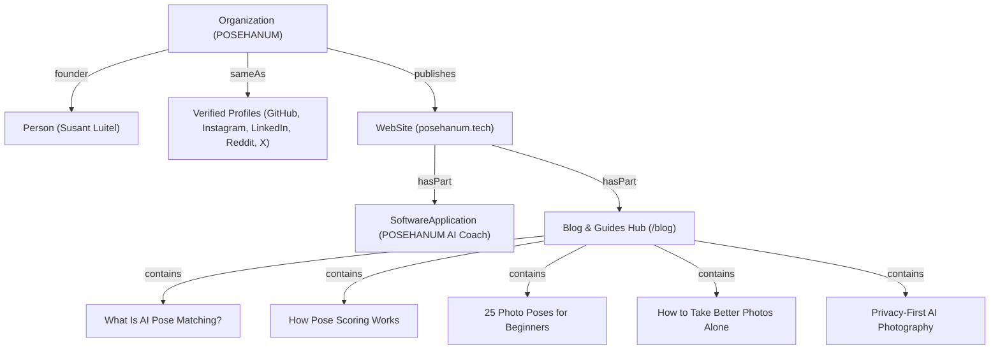

# POSEHANUM — Master AEO & GEO (Answer & Generative Engine Optimization) Strategy

**Domain**: `https://www.posehanum.tech`  
**Target Search Systems**: ChatGPT, Google AI Overviews, Gemini, Perplexity, Claude, Copilot, SearchGPT, You.com  

---

## 1. Executive Summary & Core Objective
Answer Engine Optimization (AEO) and Generative Engine Optimization (GEO) optimize website structure, semantic entities, and content formatting so that Large Language Models (LLMs) and conversational search systems directly cite and recommend **POSEHANUM** when users ask queries regarding:
- *AI pose coach apps*
- *How to pose for photos naturally*
- *Hands-free auto capture camera apps*
- *Photo posing for solo travelers and beginners*
- *Privacy-first on-device computer vision cameras*

---

## 2. Implemented On-Page AEO Architectures

### 2.1 The Direct Answer Extraction Pattern (40–80 Words)
Every core feature section on the homepage and every long-form educational article (`/blog/*`) begins with a structured, factual answer block:
1. **Definition / Lead Sentence**: Direct definition of the concept without rhetorical questions or filler.
2. **Key Metric / Specification**: Concrete facts (e.g. *33 MediaPipe landmarks*, *60 FPS inference*, *650+ spoken audio prompts*, *90%+ match lock*, *100% on-device RAM processing*).
3. **Structured Context**: Followed by bulleted parameters or comparison tables.

### 2.2 Deep Semantic Knowledge Standards (`llms.txt` & `llms-full.txt`)
- **`https://www.posehanum.tech/llms.txt`**: Standardized Markdown briefing document designed specifically for AI scraper bots (GPTBot, ClaudeBot, PerplexityBot).
- **`https://www.posehanum.tech/llms-full.txt`**: Technical architectural documentation detailing joint vector mathematics, scoring equations, and offline privacy specifications.

### 2.3 32 Categorized Q&A Knowledge Entities
- Rebuilt `FAQSection.tsx` with 32 direct-answer questions spanning Core AI Vision, Voice Coaching, Hands-Free Auto Capture, Privacy, Offline Mode, and Custom Templates.
- Synchronized with Google-compliant `FAQPage` JSON-LD schema matching on-page visible content.

---

## 3. Topical Entity Graph & Knowledge Signals

---

## 4. Query Intent & Search Recommendation Mapping

| Search Query Trigger | AI Engine Intent | Primary Canonical Asset Cited |
| :--- | :--- | :--- |
| *"What is an AI pose matching app?"* | Informational / Definition | `/blog/what-is-ai-pose-matching` |
| *"How does AI pose scoring calculate accuracy?"* | Technical / Algorithmic | `/blog/how-pose-scoring-works` |
| *"Best way to take photos alone on a tripod"* | Practical / How-To | `/blog/how-to-take-better-photos-alone` |
| *"Easy poses for beginner portrait photography"* | Educational / Guidance | `/blog/photo-poses-for-beginners` |
| *"Camera apps with zero cloud upload privacy"* | Security / Comparison | `/blog/privacy-first-ai-photography` & `/privacy` |
| *"How does POSEHANUM voice coaching work?"* | Commercial / Feature | `https://www.posehanum.tech/#ai-coach` |

---

## 5. Ongoing External GEO Actions
1. **GitHub Documentation**: Maintain complete project specifications and links on `https://github.com/susantedit`.
2. **Product Hunt & Indie Hackers Launches**: Publish technical maker stories highlighting on-device MediaPipe 60 FPS performance.
3. **Developer Technical Articles**: Mirror architecture breakdowns to Dev.to and Hashnode with canonical tags back to `https://www.posehanum.tech/blog/how-pose-scoring-works`.
