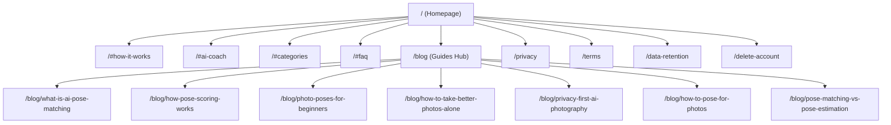

# POSEHANUM — Internal Link Architecture & Topic Graph

**Domain**: `https://www.posehanum.tech`  
**Crawl Path Depth**: Maximum 2 Clicks to Any Page  

---

## 1. Global Navigation Link Architecture

---

## 2. Contextual Topic Cluster Cross-Links

| Source Page | Target Contextual Link | Anchor Text | Purpose |
| :--- | :--- | :--- | :--- |
| **`/blog/what-is-ai-pose-matching`** | `/blog/how-pose-scoring-works` | `How Pose Scoring Works (Math & Code)` | Deepens technical authority |
| **`/blog/what-is-ai-pose-matching`** | `/blog/photo-poses-for-beginners` | `25 Best Photo Poses for Beginners` | Offers practical application |
| **`/blog/how-pose-scoring-works`** | `/blog/pose-matching-vs-pose-estimation` | `Pose Matching vs. Pose Estimation` | Explains architectural contrast |
| **`/blog/photo-poses-for-beginners`** | `/blog/how-to-pose-for-photos` | `How to Pose for Photos Masterclass` | Advanced posture progression |
| **`/blog/how-to-take-better-photos-alone`** | `/#ai-coach` | `adaptive audio coach` | Connects problem to core feature |
| **`/blog/privacy-first-ai-photography`** | `/privacy` | `Official Privacy Policy` | Legal & compliance anchor |
| **`404 Not Found (/not-found)`** | `/blog` & `/` | `Guides Hub` & `Homepage` | Prevents bounce rate leaks |

---

## 3. Anchor Text Rules
- ❌ **Forbidden**: "click here", "read more", "link", "page".
- ✅ **Standard**: Descriptive keyword phrases (e.g. *learn how AI pose matching works*, *explore 15 curated pose collections*, *read the privacy architecture deep dive*).
